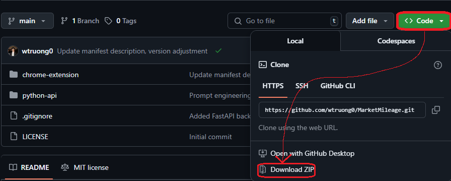

# MarketMileage 🔍🚗

**MarketMileage** is a lightweight Chrome extension that uses DeepSeek V3 to estimate fair private-party car values within Facebook Marketplace listings.

---

## 🚀 Features
- ✅ Automatically scrapes listing details (title for YMM, mileage, listing price)
- 🧠 Condition dropdown for user-defined tuning
- 🤖 Uses a DeepSeek API to provide fast price estimations
- 🟢 Color-coded labels: Valued as [Good / Fair / Poor]
- 📍 Embedded UI: No popup required, an inline overlay

---

## 🛠 How to Install

1. **Download this repository** (I suggest following the image above).
2. Open Chrome and navigate to [`chrome://extensions`](chrome://extensions).
3. **Enable Developer Mode** (toggle bar in the top right).
4. Click **"Load unpacked"** and select the `chrome-extension` folder from inside this project.
5. Navigate to any **Facebook Marketplace** car listing.
6. Click **"Estimate with AI 🤖"** next to the price — and enjoy using MarketMileage!

---

## 📷 How It Works
Once installed, MarketMileage embeds directly into Facebook Marketplace listings.

It:
- Scrapes the listing title and mileage
- Sends that data to an AI valuation backend
- Returns a fair estimate with deal quality and color-coded feedback

---

## 🔧 Tech Stack
- Chrome Extensions platform (Manifest v3)
- JavaScript Document Object Module (DOM) injection
- Python FastAPI backend
  - Server-side hosting through Railway
- DeepSeek AI model via Chutes.ai API integration

---

## 📎 Links
- [🔗 Original GitHub Repository](https://github.com/wtruong0/MarketMileage)
- [📇 LinkedIn](https://www.linkedin.com/in/truongw)

---

## ✍️ Credits
Created by **Will Truong**  
Licensed under MIT
